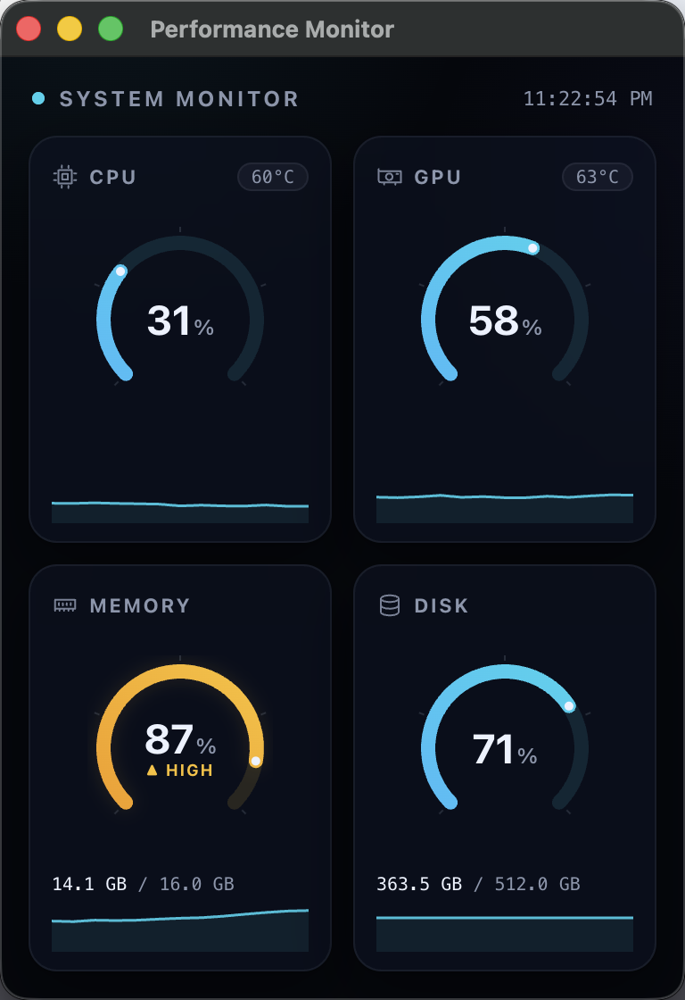

# Performance Monitor

A lightweight macOS/Windows menu bar app that shows live CPU, RAM, Disk, and GPU
usage, with native notifications when a metric stays critically high for too
long. Built with [Tauri](https://tauri.app/) 2, SvelteKit, and Rust.



## Features

- **Tray-first UX** — lives in the menu bar; click the tray icon to toggle the
  dashboard window, no dock icon or taskbar entry. A second launch just
  refocuses the existing window instead of opening a duplicate instance.
- **Instrument-panel dashboard** — a 270° arc gauge per metric with a
  severity-driven color ramp (calm cyan → amber at 85% → glowing red at 99%),
  a status badge at high/critical, used/total bytes (RAM, Disk), and
  temperature where available.
- **Sparklines** — each card keeps the last ~60 samples and draws a live
  one-minute trend under the gauge.
- **Adaptive polling** — samples every 1s while the dashboard is visible,
  backs off to every 3s while hidden, to save CPU in the background.
- **Threshold alerts** — fires a native OS notification when a metric crosses
  a critical threshold and *stays* there (debounced, so a brief spike won't
  page you), then re-notifies periodically until it drops back down
  (hysteresis-based re-arm). See `src-tauri/src/state.rs`.
- **Light footprint** — measured on an M5 MacBook (release build, window
  hidden): ~0.2% of one core average, ~86 MB RSS.

### Known v1 gaps

There's no maintained, public cross-platform API for GPU usage or CPU
temperature, so these degrade gracefully to "Unavailable" rather than
guessing:

| Metric      | macOS         | Windows                  |
| ----------- | ------------- | ------------------------- |
| CPU / RAM   | ✅ (`sysinfo`) | ✅ (`sysinfo`)             |
| Disk        | ✅ (`sysinfo`) | ✅ (`sysinfo`)             |
| GPU usage   | Unavailable   | ✅ NVIDIA only (NVML)      |
| CPU temp    | Unavailable   | ✅ if ACPI thermal zone exists (WMI) |

## Development

```bash
npm install
npm run tauri dev
```

Type-check the frontend:

```bash
npm run check
```

**UI work without the Rust backend:** `npm run dev` and open
`http://localhost:1420` in a browser — outside Tauri the metrics store
substitutes a random-walk demo stream, so the dashboard renders with moving
(fake) data.

## Release build

```bash
npm run tauri build
```

Produces `src-tauri/target/release/bundle/macos/Performance Monitor.app` and a
`.dmg` alongside it. The bundle is unsigned; local use is fine, distribution
needs codesigning/notarization.

## Project layout

- `src/` — SvelteKit dashboard UI (`routes/+page.svelte`, `lib/Gauge.svelte`,
  `lib/MetricCard.svelte`, `lib/Sparkline.svelte`, `lib/stores/metrics.ts`)
- `src-tauri/src/sensors/` — per-metric sampling (`cpu.rs`, `mem.rs`,
  `disk.rs`, `gpu.rs`, `temp.rs`)
- `src-tauri/src/tray.rs` — tray icon, menu, show/hide window behavior
- `src-tauri/src/notify.rs` + `state.rs` — alert thresholds and native
  notifications
- `src-tauri/src/lib.rs` — app setup and the background metrics polling loop
